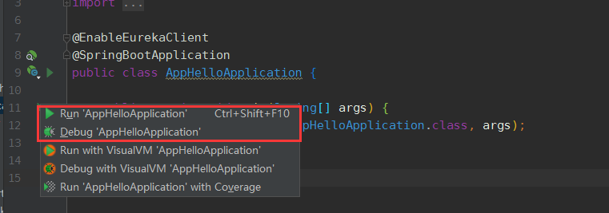
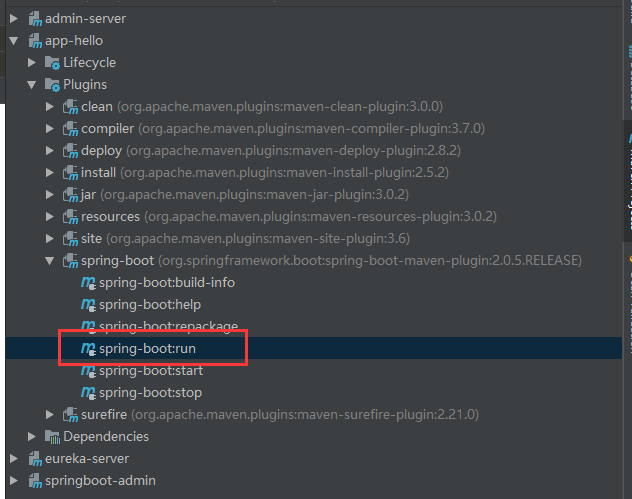
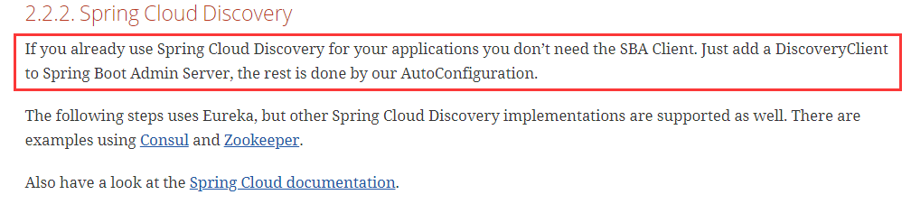

##在application.properties或application.yml中引用pom.xml的变量不生效的问题
引用方式  `@project.name@` ，在application.yml需要加单引号或双引号， `'@project.name@'`

如果使用main方法启动程序则无法替换变量，显示为 @project.name@



可行方法如下：
####  mvn clean install 
 * `cd app-hello`
 * `mvn clean install -Dmaven.test.skip=true`
 * `java -jar app-hello.jar`

####  spring-boot  run 
* 双击spring-boot的maven插件run即可




##### 当App注册到服务中心（如Eureka、Consul、Zookeeper等），在App中无需Spring-Boot-Admin的依赖，Spring-Admin-Boot可以通过服务中心自动实现监控




##### 配置spring-boot-starter-mail监控应用状态变化
```
  spring.mail.host=smtp.163.com
  spring.mail.username=springbootadmin163@163.com
  spring.mail.password=spring123
  spring.mail.properties.mail.smtp.auth=true
  spring.mail.properties.mail.smtp.starttls.enable=true
  spring.mail.properties.mail.smtp.starttls.required=true
  
  spring.boot.admin.notify.mail.from=${spring.mail.username}
  
  spring.boot.admin.notify.mail.to=want2015@yeah.net
```
* 163邮箱开启smtp需要配置授权码，`password`设置成配置的授权码
* `spring.boot.admin.notify.mail.from`需配置成和`spring.mail.username`相同的值
* `spring.boot.admin.notify.mail.to` 接受通知的邮件地址
* `spring.boot.admin.notify.mail.template` 可以配置自定义模板 

