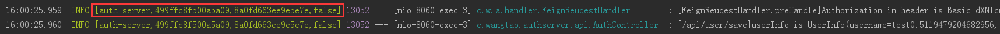

##在application.properties或application.yml中引用pom.xml的变量不生效的问题
引用方式  `@project.name@` ，在application.yml需要加单引号或双引号， `'@project.name@'`

如果使用main方法启动程序则无法替换变量，显示为 @project.name@


可行方法如下：
####  mvn clean install 
 * `cd app-hello`
 * `mvn clean install -Dmaven.test.skip=true`
 * `java -jar app-hello.jar`

####  spring-boot  run 
* 双击spring-boot的maven插件run即可


##### 当App注册到服务中心（如Eureka、Consul、Zookeeper等），在App中无需Spring-Boot-Admin的依赖，Spring-Admin-Boot可以通过服务中心自动实现监控


##### 配置spring-boot-starter-mail监控应用状态变化
```
  spring.mail.host=smtp.163.com
  spring.mail.username=springbootadmin163@163.com
  spring.mail.password=spring123
  spring.mail.properties.mail.smtp.auth=true
  spring.mail.properties.mail.smtp.starttls.enable=true
  spring.mail.properties.mail.smtp.starttls.required=true
  
  spring.boot.admin.notify.mail.from=${spring.mail.username}
  
  spring.boot.admin.notify.mail.to=want2015@yeah.net
```
* 163邮箱开启smtp需要配置授权码，`password`设置成配置的授权码
* `spring.boot.admin.notify.mail.from`需配置成和`spring.mail.username`相同的值
* `spring.boot.admin.notify.mail.to` 接受通知的邮件地址
* `spring.boot.admin.notify.mail.template` 可以配置自定义模板 

##Sleuth使用
* 引入sleuth依赖
```
  <dependency>
     <groupId>org.springframework.cloud</groupId>
     <artifactId>spring-cloud-starter-sleuth</artifactId>
  </dependency>
```
输出日志中显示如下信息

    

* application name — 应用的名称，也就是application.properties中的spring.application.name参数配置的属性。
* traceId — 为一个请求分配的ID号，用来标识一条请求链路。
* spanId — 表示一个基本的工作单元，一个请求可以包含多个步骤，每个步骤都拥有自己的spanId。一个请求包含一个TraceId，多个SpanId
* export — 布尔类型。表示是否要将该信息输出到类似Zipkin这样的聚合器进行收集和展示。


##Security默认登录页面和退出页面
since 5.0
```
org.springframework.security.web.server.ui.LoginPageGeneratingWebFilter.createPage()
org.springframework.security.web.server.ui.LogoutPageGeneratingWebFilter.createPage()
```
* 5.1.1的LoginPage
```
<!DOCTYPE html>
<html lang="en">
<head>
	<meta charset="utf-8">
	<meta name="viewport" content="width=device-width, initial-scale=1, shrink-to-fit=no">
	<meta name="description" content="">
	<meta name="author" content="">
	<title>Please sign in</title>
	<link href="https://maxcdn.bootstrapcdn.com/bootstrap/4.0.0-beta/css/bootstrap.min.css" 
	rel="stylesheet" 
	integrity="sha384-/Y6pD6FV/Vv2HJnA6t+vslU6fwYXjCFtcEpHbNJ0lyAFsXTsjBbfaDjzALeQsN6M" crossorigin="anonymous">
	<link href="https://getbootstrap.com/docs/4.0/examples/signin/signin.css" rel="stylesheet" crossorigin="anonymous"/>
</head>
<body>
    <div class="container">
	    <form class="form-signin" method="post" action="/login">
		    <h2 class="form-signin-heading">Please sign in</h2>
			
			<--!isError-->
			<div class="alert alert-danger" role="alert">Invalid credentials</div>
			
			<--!isLogoutSuccess-->
			<div class=\"alert alert-success\" role=\"alert\">You have been signed out</div>"
			
			<p>
				<label for="username" class="sr-only">Username</label>
				<input type="text" id="username" name="username" class="form-control" placeholder="Username" required autofocus>
			</p>
			<p>
				<label for="password" class="sr-only">Password</label>
				<input type="password" id="password" name="password" class="form-control" placeholder="Password" required>
			</p>
			<button class="btn btn-lg btn-primary btn-block" type="submit">Sign in</button>
		</form>
		
		<div class="container">
			<h2 class="form-signin-heading">Login with OAuth 2.0</h2>
			<table class="table table-striped">
			<tr>
				<td>
					<a href="clientAuthenticationUrl">clientName</a>
				</td>
			</tr>
			</table>
		</div>
	</div>
</body>
</html>
```
* 5.1.1的LogoutPage
```
<!DOCTYPE html>
<html lang="en">
   <head>
    <meta charset="utf-8">
    <meta name="viewport" content="width=device-width, initial-scale=1, shrink-to-fit=no">
    <meta name="description" content="">
    <meta name="author" content="">
    <title>Confirm Log Out?</title>
    <link href="https://maxcdn.bootstrapcdn.com/bootstrap/4.0.0-beta/css/bootstrap.min.css" rel="stylesheet" 
    integrity="sha384-/Y6pD6FV/Vv2HJnA6t+vslU6fwYXjCFtcEpHbNJ0lyAFsXTsjBbfaDjzALeQsN6M" crossorigin="anonymous">
    <link href="https://getbootstrap.com/docs/4.0/examples/signin/signin.css" rel="stylesheet" crossorigin="anonymous"/>
   </head>
   <body>
    <div class="container">
        <form class="form-signin" method="post" action="/logout">
            <h2 class="form-signin-heading">Are you sure you want to log out?</h2>
            <input type="hidden" name="tokenParameterName" value="tokenValue">
            <button class="btn btn-lg btn-primary btn-block" type="submit">Log Out</button>
        </form>
    </div>
   </body>
</html>
 ```

since 2.0
```
org.springframework.security.web.authentication.ui.DefaultLoginPageGeneratingFilter.generateLoginPageHtml()
```
页面结构如下：
```
<html>
<head>
    <title>Login Page</title>
</head>
<body onload='document.f.usernameParameter.focus();'>
    <p>
        <font color='red'>Your login attempt was not successful, try again.<br/><br/>Reason: errorMsg</font>
    </p>
    <p>
        <font color='green'>You have been logged out</font>
    </p>
    
    <h3>Login with Username and Password</h3>
    
    <--!formLoginEnabled-->
    <form name='f' action='authenticationUrl' method='POST'>
        <table>
            <tr>
                <td>User:</td>
                <td><input type='text' name='usernameParameter' value=''></td>
            </tr>
            <tr>
                <td>Password:</td>
                <td><input type='password' name='passwordParameter'/></td>
            </tr>
            <tr>
                <td><input type='checkbox' name='rememberMeParameter'/></td>
                <td>Remember me on this computer.</td>
            </tr>
            <tr>
                <td colspan='2'><input name="submit" type="submit" value="Login"/></td>
            </tr>
            <input name='token' type="hidden" value="token" />
        </table>
    </form>
    
    <--!formLoginEnabled-->
    <h3>Login with OpenID Identity</h3>
    <form name='oidf' action='openIDauthenticationUrl' method='POST'>
        <table>
            <tr>
                <td>Identity:</td>
                <td><input type='text' size='30' name='openIDusernameParameter'/></td>
            </tr>
            <tr>
                <td><input type='checkbox' name='openIDrememberMeParameter'></td>
                <td>Remember me on this computer.</td>
            </tr>
            <tr>
                <td colspan='2'><input name="submit" type="submit" value="Login"/></td>
            </tr>
            <input name='token' type="hidden" value="token" />
        </table>
    </form>
    
</body>
</html>
```
#####Security调试
设置 `@EnableWebSecurity(debug = true)` 看到详细的日志输出，可以定位问题。