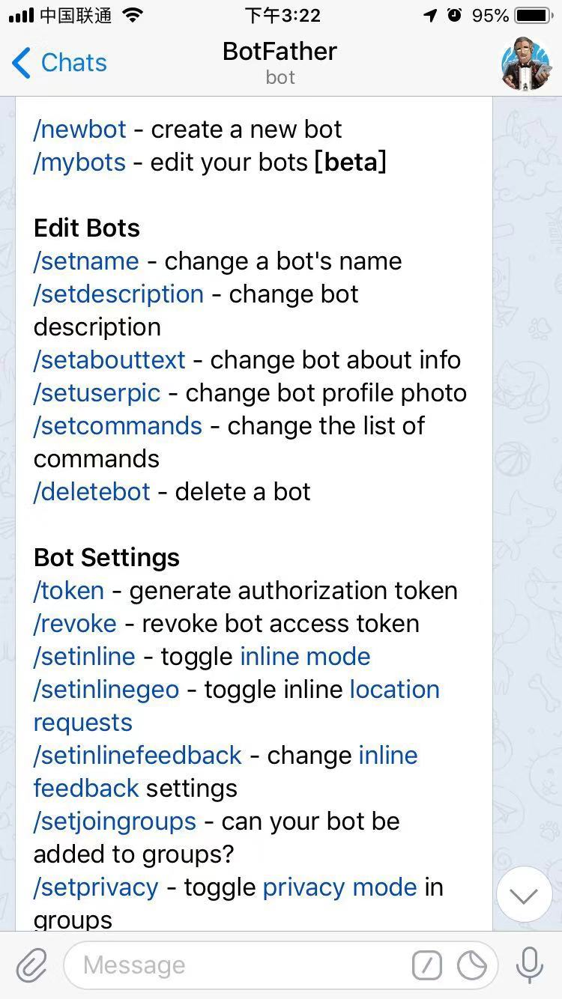
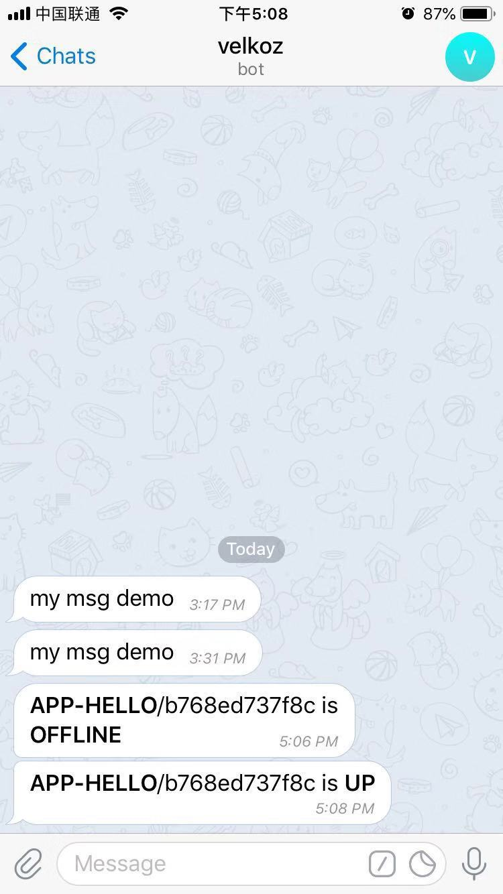

### Telegram通知配置
#####1、下载App，注册登录
#####2、chats页面搜索BotFather，发送消息
#####3、新建自己的bot，给BotFather发送`/newbot`，根据提示创建bot

#####3、给BotFather发送`/mybots`，选择自己的bot，然后点击`API Token`
* token格式如：```794088865:AAGI_-l2vk8OL7fAar2USPHuJ-OrLs5DHQI```
#####4、根据Token获取chat-id
* 请求地址：```https://api.telegram.org/bot794088865:AAGI_-l2vk8OL7fAar2USPHuJ-OrLs5DHQI/getUpdates```，其中包含上面获取的Token
* 返回结果：
```
{
     "ok": true,
     "result": [
         {
             "update_id": 781345320,
             "message": {
                 "message_id": 9,
                 "from": {
                     "id": 742284138,
                     "is_bot": false,
                     "first_name": "wang",
                     "username": "tao1108",
                     "language_code": "zh-hans"
                 },
                 "chat": {
                     "id": 742284138,
                     "first_name": "wang",
                     "username": "tao1108",
                     "type": "private"
                 },
                 "date": 1544079428,
                 "text": "/start",
                 "entities": [
                     {
                         "offset": 0,
                         "length": 6,
                         "type": "bot_command"
                     }
                 ]
             }
         }
     ]
 }
```
`chat`下的`id`就是我们需要的chat-id
#####4、使用Postman测试发送消息
* 请求地址：
```
https://api.telegram.org/bot794088865:AAGI_-l2vk8OL7fAar2USPHuJ-OrLs5DHQI/sendmessage?chat_id=742284138&text=my msg demo&parse_mode=HTML&disable_notification=false
```
* App上收到`mybot`发的信息`my msg demo`


## 怎么群发消息呢？或者给一个聊天群发消息呢？在聊天群里创建一个bot吗？